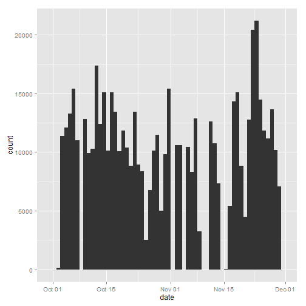
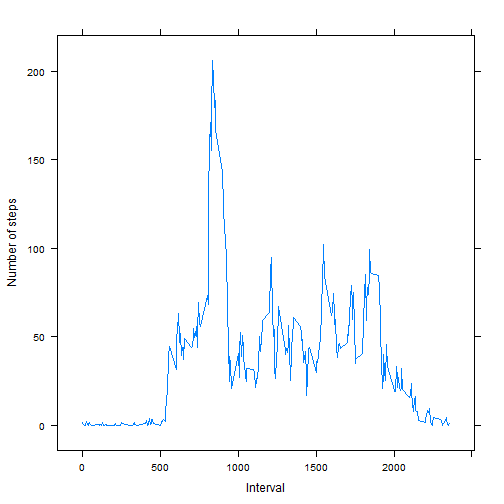
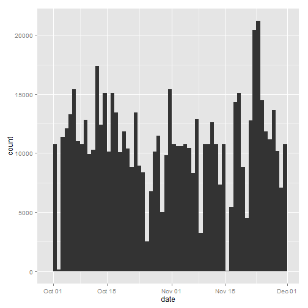

# Reproducible Research: Peer Assessment 1


## Loading and preprocessing the data

Load the libraries we will need:


```r
library(ggplot2)
library(zoo)
library(lattice)
```


Unzip and read the data, converting the column to their correct types.

All processing is done in the read.csv


```r
unzip("activity.zip")
data <- read.csv("activity.csv", header = TRUE, sep = ",", colClasses = c("numeric", 
    "Date", "numeric"))
```


## What is mean total number of steps taken per day?

Create a list of the total steps per day and then display the histogram.


```r
totalSteps <- aggregate(list(steps = data$steps), by = list(date = data$date), 
    FUN = sum, na.rm = TRUE)
qplot(date, weight = steps, data = totalSteps, geom = "histogram", binwidth = 1)
```

 


The average number of steps per day and the median of the number of steps per day are:


```r
mean(totalSteps$steps)
```

```
## [1] 9354
```

```r
median(totalSteps$steps)
```

```
## [1] 10395
```


## What is the average daily activity pattern?

Create a list that contains the average number of steps per interval


```r
dailyActivity <- aggregate(list(steps = data$steps), by = list(interval = data$interval), 
    FUN = mean, na.rm = TRUE)
xyplot(steps ~ interval, data = dailyActivity, type = "l", xlab = "Interval", 
    ylab = "Number of steps")
```

 


The interval with the maximum number of steps is


```r
dailyActivity[which(dailyActivity[, "steps"] == max(dailyActivity$steps)), "interval"]
```

```
## [1] 835
```


## Imputing missing values

Report on the number of rows with NA


```r
sum(is.na(data))
```

```
## [1] 2304
```


Fill in the missing data with the average number of steps for that interval. The new data frame is called fixedData


```r
fixedData <- data
fixedData$steps <- na.aggregate(data$steps, by = data$interval, FUN = mean)
```


Create a list of the total steps per day and then display the histogram.


```r
totalSteps <- aggregate(list(steps = fixedData$steps), by = list(date = fixedData$date), 
    FUN = sum, na.rm = TRUE)
qplot(date, weight = steps, data = totalSteps, geom = "histogram", binwidth = 1)
```

 


The average number of steps per day and the median of the number of steps per day are:


```r
mean(totalSteps$steps)
```

```
## [1] 10766
```

```r
median(totalSteps$steps)
```

```
## [1] 10766
```


As an effect of our filling in the missing values, the mean and the median are both slightly higher. Also, the mean and the median are now the same.

## Are there differences in activity patterns between weekdays and weekends?

Add a new column with the weekend, weekdays factor


```r
fixedData$dayType = as.factor(weekdays(fixedData$date))
levels(fixedData$dayType) <- c("weekday", "weekday", "weekend", "weekend", "weekday", 
    "weekday", "weekday")
```


Create a list of the total steps per day and display the data in a panel plot, ordered by interval to get clean lines


```r
dailyActivity <- aggregate(list(steps = fixedData$steps), by = list(interval = fixedData$interval, 
    dayType = fixedData$dayType), FUN = mean, na.rm = TRUE)
xyplot(steps ~ interval | dayType, data = dailyActivity, type = "l", layout = c(1, 
    2), xlab = "Interval", ylab = "Number of steps")
```

 

